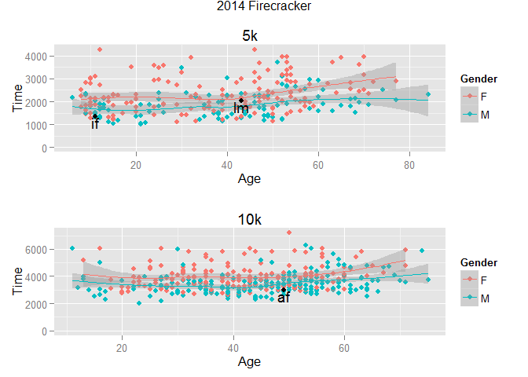

# Firecracker 5/10K 2014 Analysis
### Intro
Every July 4, the firecracker 5k/10k races occur in Santa Cruz. This project
explores data from the 2014 race.  

### Setup
First, load some libraries...

```r
library(stringr)
library(ggplot2)
library(gridExtra)
```

```
## Loading required package: grid
```

```r
library(RCurl)
```

```
## Loading required package: bitops
```

```r
library(XML)
```

```
## Warning: package 'XML' was built under R version 3.2.0
```

### Function Definitions
A funtion to convert HH:MM::SS to seconds:


```r
to_seconds_recur <- function(x, val) {
  if (length(x) == 0)
    return(val)

  val <- 60 * val + x[1]
  return(to_seconds_recur(x[-1], val))
}

to_seconds <- function(x) {
  return(to_seconds_recur(as.integer(x), 0))
}
```

Read data from an xmlValue


```r
read_raw <- function(text) {
  con <- textConnection(text)
  data <- readLines(con)
  close(con)
  
  return(data)
}
```

Discard header data up to the line that contains "===="


```r
discard_header <- function(data) {
  index <- 1 # index of the _next_ line to be read
  for (line in data) {
    index <- index + 1
    if (grepl("^=", line)) {
      break
    }
  }

  return(data[index:length(data)])
}
```

Drop any blank lines.

```r
discard_blanks <- function(data) {
  blanks <- grepl("^$", data)

  return(data[!blanks])
}
```

Double-check the data - all this parsing is fragile, so try to fail early.

```r
check_raw_data <- function(sig, data) {
  if (!any(grepl(pattern = sig, x = data, fixed=TRUE))) {
    print(sprintf("Failed to find signature string '%s'\n", sig))
    return(FALSE)
  }
  return(TRUE)
}
```

Load data from the given url.

```r
get_data_from_url <- function(url) {
  html <- htmlParse(url)
  pres <- getNodeSet(html, "//pre")
  data5k <- xmlValue(pres[[1]])
  data10k <- xmlValue(pres[[2]])

  data5k <- read_raw(data5k)
  data10k <- read_raw(data10k)

  # Check the data
  checked5k <- check_raw_data("5-K Results", data5k)
  checked10k <- check_raw_data("10-K Results", data10k)

  if (!checked5k)
    print("didn't manage to read good 5k data, giving up.")
  if (!checked10k)
    print("didn't manage to read good 10k data, giving up.")

  if (!checked5k || !checked10k)
    return(c(NA, NA))

  # discard up to and including the header line ("====...")
  data5k <- discard_header(data5k)
  data10k <- discard_header(data10k)

  # ... and discard any remaining blank lines.
  data5k <- discard_blanks(data5k)
  data10k <- discard_blanks(data10k)

  data5k <- parseit(data5k)
  data10k <- parseit(data10k)

  data5k <- clean_data(data5k)
  data10k <- clean_data(data10k)

  return(list(data5k, data10k))
}
```

Label the data.

```r
parseit <- function(data) {
  len <- length(data)
  the_names <- 
    c("Rank", "Age.Rank", "Name", "Age", "Gender", "City", "Time", "Pace")
  newdata <- data.frame(stringsAsFactors=FALSE,
    rep(1, len),
    rep("X", len),
    rep("X", len),
    rep(1, len),
    rep("X", len),
    rep("X", len),
    rep("X", len),
    rep("X", len)
  )

  names(newdata) <- the_names

  for (i in 1:len) {
    line <- data[i]
    newrow <- clean_line(line)
    newdata[i, ] <- newrow
  }

  # Hacky - set type on int fields.
  newdata$Age <- as.numeric(newdata$Age)
  newdata$Rank <- as.numeric(newdata$Rank)

  return(newdata)
}
```

Load the data from fixed field positions into variables.

```r
clean_line <- function(line) {
  fields <- c(as.character())
  starts <- c(1,  6, 16, 43, 46, 47, 64, 72)
  stops <-   c(5, 15, 42, 45, 46, 63, 71, 76)
  
  for (i in 1:length(starts)) {
    start <- starts[i]
    stop <- stops[i]

    str <- substring(line, start, stop)
    str <- str_trim(str)
    fields <- c(fields, str)
  }

  return(fields)
}
```

More data tidying.

```r
clean_data <- function(data) {
  the_names <-
    c("Rank", "Age.Rank", "Name", "Age", "Gender", "City", "Time", "Pace")
  names(data) <- the_names
  data$Age.Rank <- str_trim(data$Age.Rank)
  data$Name <- str_trim(data$Name)
  data$Pace <- str_trim(data$Pace)

  # Remove data with missing age.
  data <- subset(data, !is.na(Age))

  runtime <- 
    sapply(data$Time, FUN=function(x) unlist(strsplit(as.character(x), ':')))

  time2 <-
    sapply(runtime, FUN=function(x) to_seconds(unlist(x)))

  data$Time <- time2
  return(data)
}
```

### Reading the data from the Intrawebs
Load data from the url.

```r
the_data <-
  get_data_from_url("http://www.santacruzfirecracker10k.org/race-results-2014")
```
Grab 5k and 10k data from the XML tree.

```r
data5k <- the_data[[1]]
data10k <- the_data[[2]]
```

### Highlighting some special points
Extract some specific points, by runner name.

```r
AF <- subset(data10k, Name == "AARON FERRUCCI")
IF <- subset(data5k, Name == "IAN FERRUCCI")
LM <- subset(data5k, Name == "LORI MATSUMOTO")
```

### Plotting

```r
plot5k <-
  qplot(Age, Time, data=data5k, main="5k", ylim=c(0, NA), col=Gender) +
    geom_point() +
    geom_smooth() +
    geom_point(data=LM, color="black") +
    geom_text(data=LM, label="lm", color="black", vjust=1) +
    geom_point(data=IF, color="black") +
    geom_text(data=IF, label="if", color="black", vjust=1)
plot10k <-
  qplot(Age, Time, data=data10k, main="10k", ylim=c(0, NA), col=Gender) +
    geom_point() +
    geom_smooth() +
    geom_point(data=AF, color="black") +
    geom_text(data=AF, label="af", color="black", vjust=1)
# pdf("firecracker2014.pdf", width=4, height=5)
grid.arrange(plot5k, plot10k, nrow=2, main="2014 Firecracker")
```

 

```r
# dev.off()
```

### Appendix
It's a good idea to record the session info, for reproducibility.

```r
sessionInfo()
```

```
## R version 3.1.3 (2015-03-09)
## Platform: i386-w64-mingw32/i386 (32-bit)
## Running under: Windows 7 (build 7601) Service Pack 1
## 
## locale:
## [1] LC_COLLATE=English_United States.1252 
## [2] LC_CTYPE=English_United States.1252   
## [3] LC_MONETARY=English_United States.1252
## [4] LC_NUMERIC=C                          
## [5] LC_TIME=English_United States.1252    
## 
## attached base packages:
## [1] grid      stats     graphics  grDevices utils     datasets  methods  
## [8] base     
## 
## other attached packages:
## [1] XML_3.98-1.1    RCurl_1.95-4.6  bitops_1.0-6    gridExtra_0.9.1
## [5] ggplot2_1.0.1   stringr_1.0.0  
## 
## loaded via a namespace (and not attached):
##  [1] colorspace_1.2-6 digest_0.6.8     evaluate_0.7     gtable_0.1.2    
##  [5] htmltools_0.2.6  knitr_1.10.5     labeling_0.3     magrittr_1.5    
##  [9] MASS_7.3-39      munsell_0.4.2    plyr_1.8.2       proto_0.3-10    
## [13] Rcpp_0.11.6      reshape2_1.4.1   rmarkdown_0.6.1  scales_0.2.4    
## [17] stringi_0.4-1    tools_3.1.3      yaml_2.1.13
```

